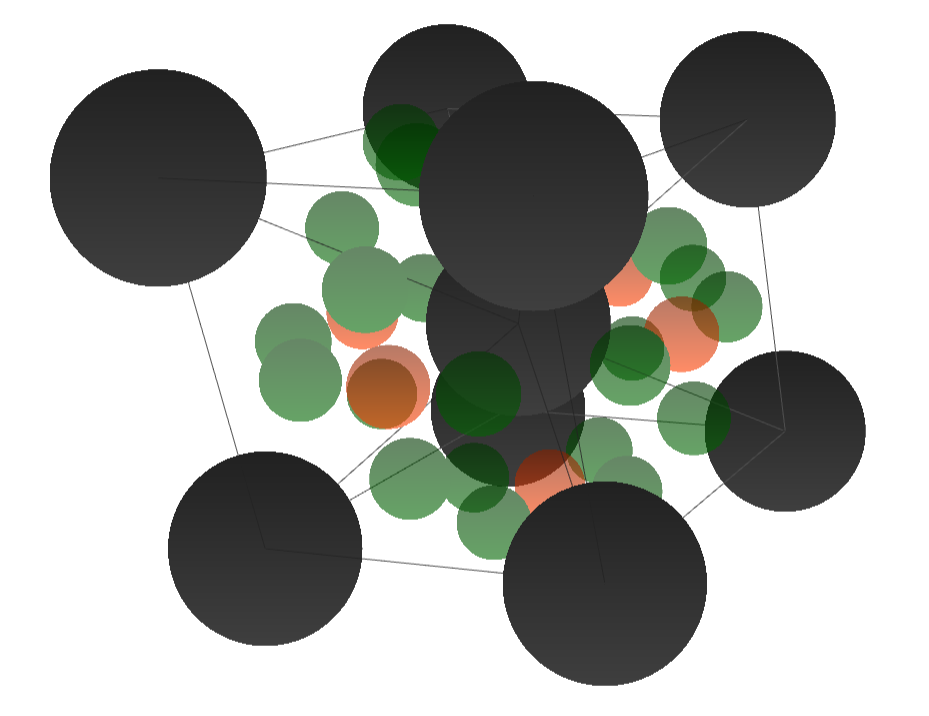
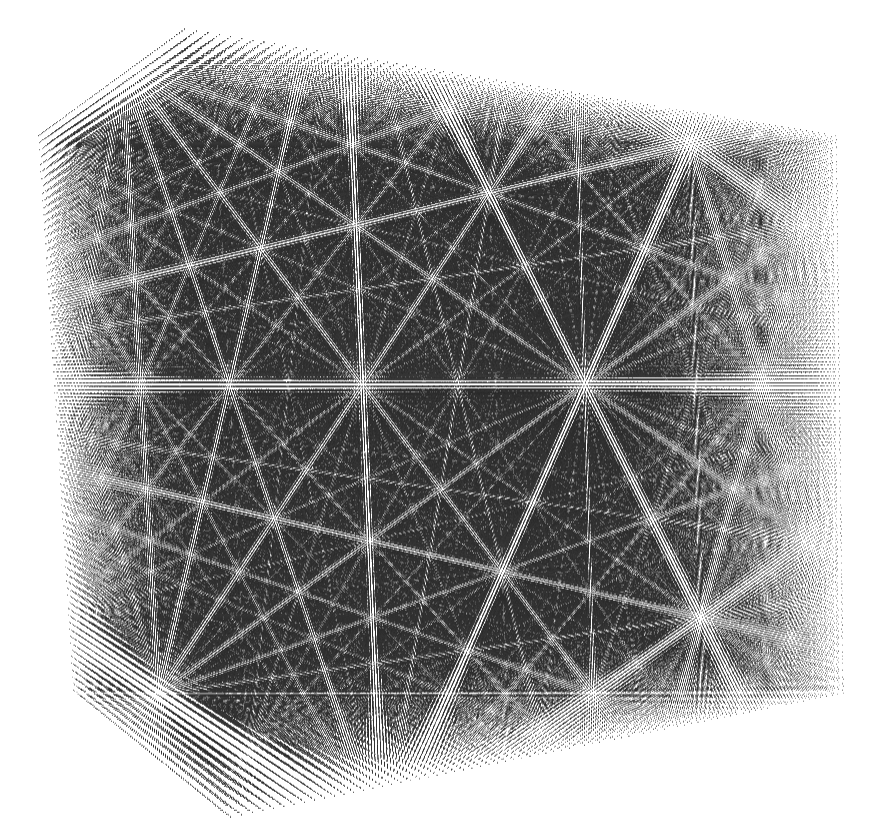

# Lattice-Visualizer  

Open-Source repository for the offline version (.exe and raw python code) of czeskleba.com/visualizer/

 

## License

This project is licensed under the Creative Commons Attribution 4.0 International License (CC BY 4.0).  
You are free to use, modify, distribute, or even commercialize it under that license.

So feel free to use it which ever way you like, expand on it, change it, make it your own. 
But if you found it helpful in any way, I'd love a citation, or a firm nod in my direction.

For more information, see the [LICENSE](LICENSE) file.
